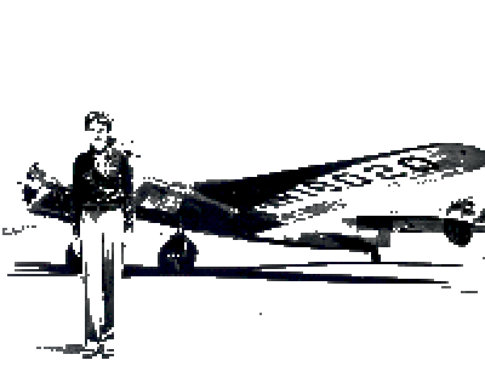

# pixel-svg
Pixel-svg is a web tool by Clément Corbin. It performs pixel-art-like vectorization over HTML Canvas & JS. Uses web-worker for performance. Output is SVG.

Grid size and output image width are configurable. A (highly perfectible) color filter is also available.

Try it online: https://corbin-c.github.io/pixel-svg

## Examples

### Amelia Earhart (Original image from [wikimedia commons](https://commons.wikimedia.org/wiki/File:Amelia_Earhart_-_GPN-2002-000211.jpg)):

After pixelization:

### View from Moscow Metro (Original image from [wikimedia commons](https://commons.wikimedia.org/wiki/File:MosMetro_Fonvizinskaya_01-2017.jpg/800px-MosMetro_Fonvizinskaya_01-2017.jpg)):

After pixelization:

